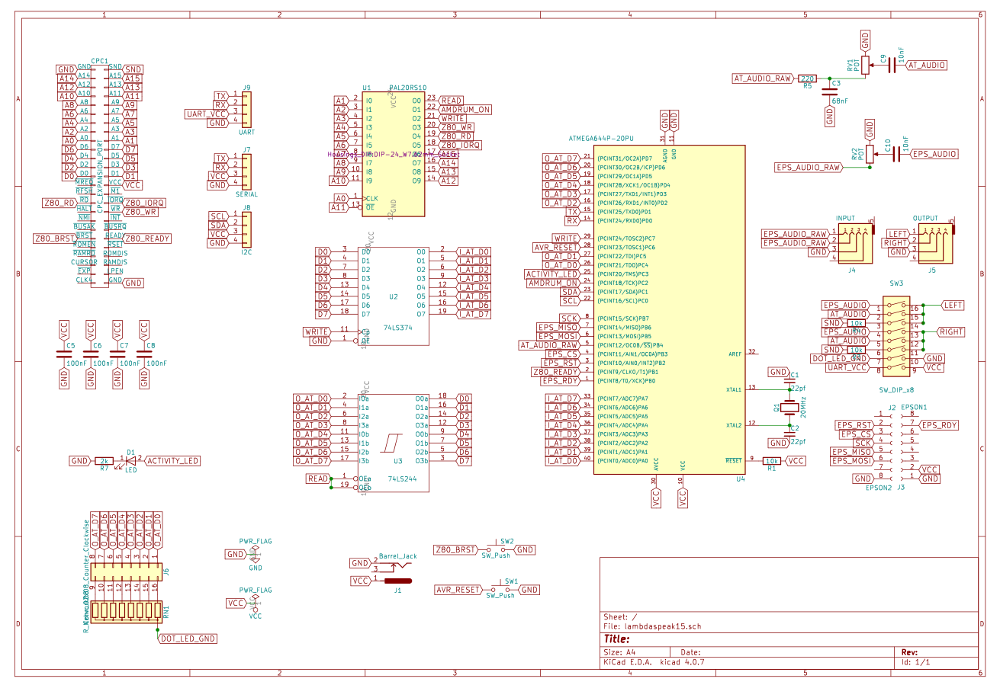

# LambdaSpeak FS

## Latest News 

The first batch of 10 was produced and distributed by TFM! 

 

 

 

 

## Demos 

[YouTube Video 1](https://youtu.be/KedbNqoHSpE)

[YouTube Video 2](https://youtu.be/ffm2ckMMNg4)

[YouTube Video 3](https://youtu.be/5-QFHwXAVIw)


## About

"LambdaSpeak FutureSoft" aka "LambdaSpeak FS" aka "LS-FS" aka "LSFS". 

Check out [LambdaSpeak
3](https://github.com/lambdamikel/LambdaSpeak3) for
details. LambdaSpeak FS does not have the SP0256-AL2, and the
EEPROM-based (autonomous PCM sample-playing) functions are not
available either. 

But it has a serial high-speed connector for additional usage.
Moreover, it features a new `echo-byte` mode / control byte / mode 
`&C4` (yes, an explosive feature it is!). This mode allows the CPC to
take control over the LED Bar Segment Display, which is actually a 
full digital 8bit output port. It can be used as such by simply
removing the Segment Bar LED Display from the DIL socket and, e.g., by 
sticking DuPont connector cables into it (instead of the LEDs).

Another difference is optimized audio performance. Due to the absence
of the SP0256-AL2, we adopted a much simpler audio routing path,
omitting the audio op-amp for mixing, and optimized the filter
performance for a crystal clear and sharp digital sound. In
comparison, LambdaSpeak 3 sounds "warmer" and less clear. Somewhat
similar to an Amiga 500 with filter on / off (LSFS is filter off).
For PCM sound, this give the optimal performance in our opinion.

As with LambdaSpeak 3, the Amdrum / PCM sample playing mode is entered
by sending control byte `&E3`. A new feature is that the PCM mode can
be exited programmatically by sending the "exit sequence", without
having to power cycle the board. This sequence is `4 6 4 6 1 2 8`,
plus 127, so `131, 133, 131, 133, 128, 129, 135`.  However, checking
for this sequence in the stream of PCM sample bytes is expensive and
hence might reduce PCM sample quality slightly, so there is also a
mode in which the exit check is not being performed. See below.

Compared to LambdaSpeak 3, LSFS offers more control over the Amdrum /
PCM sample quality. LSFS features three different Amdrum modes. The
default is the `Standard` Amdrum mode.  This mode does a lightshow on
the LED Segment Bar, and also performs the exit check. The PCM
clipping range is set to 5, i.e., PCM bytes below 5 and above 250 will
be clipped and set to 5 resp. 250. 

The Amdrum mode / PCM sample quality can be specified as follows, by
first determining the mode, and then by using the mode by sending `&E3`
to enable the Amdrum mode: 

- `&FE`: Use Standard Amdrum mode. This
has a default PCM clipping range of 5, the lightshow is 
enabled, and the "exit check" is performed. 
- `&FD` : Use Custom Amdrum mode. When `&E3` is activated, 4 parameters have to
be specified and sent to port `&FBEE` first, then the mode is
enabled with these custom settings. These 4 bytes: first lightshow off / on (0, 1), 
second perform exit check no / yes (0, 1),  third PCM sample byte clipping range (from 0 to 127),  
and fourth PCM smoothing delta (from 0 to 127). 
- `&FC` : Use High Quality Amdrum mode. Like the Standard mode, but without lightshow and 
the exit check is not performed, hence resulting in highest PCM sample quality possible, 
as the CPC databus is sampled with highest frequency. 

## Serial Mode 

Some changes here over the LambdaSpeak 3 version. 

The serial mode uses a ring buffer for buffering incoming serial
messages (bytes received over RX) - the receive buffer. The buffer
pointer starts again at 0 if it overflows. Two pointers are used: a
read cursor, and an input / fill pointer. Both start at 0. If the read
cursor is smaller than the input pointer, then a byte is
available. Bytes can be read from the buffer until the pointers are
equal again.

There are two different transmission modes. The default should be the
*direct mode*. In this mode, every byte sent from the CPC to `&FBEE`
is output directly to the UART (TX). There is also the *buffered
mode*, in which *output* is not sent directly to the serial
port. Rather, it is first put into the transmission buffer, and upon a
*flush buffer* command, the whole buffer is sent at once over the
serial output (TX) port. Have a look at the BASIC programs 
`SERIAL2.BAS` for the buffered mode, and `SERIAL3.BAS` for the direct
mode. Note that `buffered` only refers to the OUTGOING / TRANSMISSION 
buffer; for INCOMING messages, the RECEIVE BUFFER is ALWAYS being used. 

Note that the receiver and the transmission buffer are separate
buffers, so even in buffered mode, full-duplex communication is
possible. 

To control the UART / serial interface, sequences of control bytes are
used, and a control sequence starts with `255` / `&FF`. `255` can be
be *escaped* by sending `255` and then `255` again (so, to transmit
`255` as a content byte, send `255` twice).

The listener / command processing loop uses the READY byte 16 on the
IO port `&FBEE` to indicate that it is ready to receive the next
command or byte. Commands start with `255`, followed by another byte
to determine the command. After `255`, the READY byte indicator
changes to 3. Using a different READY byte here (i.e., `3` instead of
`16`) gives a clear indication of the current position in the
communication protocol (or the *state* of the protocol).

Also note that the sub-mode 10 and 50 listeners *do not use any 
ready byte(s)*, see below. 

Certain commands return values on the databus, i.e., query commands
such as `255, 7` and `255, 9`. An intermittent (transient) value `4`
indicates that LambdaSpeak is busy. The important command `255, 7`
checks if a byte is available in the serial receive buffer; the result
is `0` or `1`. Note that these values cannot be confused with any
ready indicator (`16` or `3`), nor the busy signal `4`.

The values returned by query commands (such as `255, 7` and `255, 8`)
are, by default, available for a certain time on the databus, and it
is expected that the CPC will scan the databus and read the presented
value while it is available.  The *time period for which these return
values are available on the databus is configurable,* using the `Slow
Getters`, `Medium Getters`, and `Fast Getters` settings - these are 20
ms, 500 us, and 10 us, respectively. The corresponding commands to
select these modes are `&E4`, `&E0`, and `&E5`. 

A word of warning - whereas the result of the *byte available query
command* `255, 7` CANNOT be confused with any synchronization byte
(`16`, `3`, or `4`), this is NOT the case for query commands that can
return arbitrary bytes from the serial receive buffer, e.g., `255, 8`
and `255, 9`. Care has to be taken in order to *not confuse the
presented query return values on the bus with synchronization bytes*,
which would result in the CPC assuming a wrong position (stage /
state) of the communication protocol. 

Synchronization was found to be *very challenging for high-speed
serial data processing,* where the CPC is reading an incoming stream
of serial bytes and concurrently processes and retrieves the serial
data bytes (i.e., to prevent buffer overflow and hence data
loss). *Asynchronous clocks* between the CPC, the ATMega MCU, and
*non-predictable processing delays caused by the interupt service 
routine (ISR) processing and buffering the incoming serial bytes* make
the protocol synchronization problem *very challenging.* 

Whereas the so-far discussed protocol (= the return value of a query
comand is presented for a certain period of time, and special marker bytes
are used to indicate protocol state / position) *works for slower serial byte rates,* it
causes *synchronization failures and hence data loss at higher
data rates.* 

*Our solution to this problem is the new `Handshake Getters`
protocol.* Rather than presenting the return value for a certain
period of time on the databus, after which the firmware moves on to
the next state in the protocol (i.e., presents the ready byte and
waits for the next command / input byte), by using this new `Handshake
Getters` protocol mode instead, the firmware *leaves the return value
on the databus as long as the CPC requires it.* The protocol then
*advances at a CPC-controlled speed*, rather than at a firmware
delay-time controlled speed (to which the CPC might have a hard time
to synchronize). Hence, the CPC advances the protocol simply by
providing a "clock" signal to the ATmega firmware, which then
transitions to the next state in the protocol. This "clock" signal is
a simple `out &fbee,<any byte>` IO Write Request. Note that the actual
`<any byte>` doesn't matter. Ideally, we should have used the `a =
inp(&fbee)` IO Read Request, but these are invisible to the ATmega
MCU, due to a hardware limitation. Hence, we can only use the IO Write
Requests for synchronization (these trigger a pin change ISR).

That way, the CPC now has *enough time* to read the query command's
return byte from the databus. The firmware is literally *waiting for
the CPC to catch up*, to reach the synchronization / rendezvous point,
similar to a "relay race" between the two programs (CPC program and
ATmega firmware).

There are two cases: In case the CPC should reach the synchronization
point *before* the ATmega firmware, it only *needs to wait long
enough* to ensure that the firmware will also have reached the
rendezvous / synchronization point when the clock signal is given by
the CPC. "Long enough" usually means a number of microseconds - even
if the ISR UART routine is under heavy load by buffering incoming
serial data at high baud rates. In case the ATmega firmware reaches
the synchronization / rendezvous point first, there is no problem - it
will halt execution to wait for the CPC's clock signal, and hence will
wait for the "CPC to catch up".

Note that ISR UART interrupts caused by incoming serial bytes might
still be hapening WHILE the firmware is waiting for the CPC clock
signal at the synchronization point. However, the UART ISR halts and
resumes the Z80 CPC CPU, hence, these interupts are invisible from a
CPC "clock" point of view. Also, if the CPC should give the clock
signal to the firmware at the very same time the UART Serial ISR
engages (this CAN happen), the clock signal will still get noticed by
the firmware, since IOWRITE Requests from the CPC are being processed
by yet another ISR (e.g., if we were simply waiting in a busy loop at
the rendezvous point for the IOREQ to happen, we might miss it since
ATmega / firmware control might be transfered to UART ISR at any point
in time, and we might miss the pin transition!). Hence, due to the
employed IO Write Request pin change ISR routine in the firmware, we
cannot miss any IO WRite Requests from the CPC (and the potential 
for concurrent ISRs is minimized by halting the Z80 CPU within the
UART ISR). 

Also note that, even if the CPC gives the clock signal a bit *too early*
(i.e., the ATmega firmware has not reached the synchronization point
yet), it *may still continue correctly,* as the IO Write Request
issued by the CPC (for the clock signal) will not go unnoticed: a pin
change ISR will register the signal even if the firmware has not
reached the synchronization point at where it is waiting for the
signal. If the signal has already been given when the firmware reaches
the synchronization point, it will simply proceed and NOT halt, and
the protocols will still be somewhat synchronized. However, it is
*strongly recommended* to not clock the firmware "too fast" in that
way, as it will again result in *clock and hence protocol
synchronization skews* that will eventually result in *protocol phase shifts and
hence data loss.* 

After the clock signal has been given by the CPC, the 2 protocols are
in perfect synchronization again.  This `Handshake Getters` protocol
is enabled using `&E2`. Hence, `&E2` should be enabled for high-speed
realtime processing of serial data streams (before entering the serial mode via
`&F1`). 

The `Handshake Getters` protocol for serial data realtime processing /
streaming is illustrated in program `SERREC11.BAS` on the
[`LSFS.DSK`](cpc/lambda/LSFS.dsk) disk. This program is a simple 
serial receiver terminal in assembler.

The following assembler routine demonstrates how to send a command
`255, <value in d register>` to the firmware / LF-FS, and how to
retrieve the result returned by the command in case of a query
command. The result is found in the accumulator, `a`. 

Note that the "clock" signal corresponds to the last `out (c),a` 
in this routine, and how the the `waitfor<n>` calls are used 
to synchronize the protocol between the CPC and the firmware: 

```
.serialdout
push de
call waitfor16
ld a,255
ld bc,&fbee
out (c),a
call waitfor3
pop de
ld a,d
ld bc,&fbee
out (c),a
call delay
in a,(c)
ld bc,&fbee
out (c),a
ret 

.delay
nop:nop:nop:nop:nop:nop:nop
ret 
``` 

The routines `waitfor3` (`waitfor16`) scan the databus until `3`
(`16`, resp.) are found. The number of `NOPs` in `.delay` is not
important, but it cannot be too small - as explained, the `.delay` 
routine needs to consume enough time, so that it is guranteed that the
firmware has already reached the rendezvous / synchronization point
when the CPC sends the clock signal. 

For completeness, serial data realtime processing using the "Medium
Getters" protocol is illustrated in `SERREC12.BAS` on the
[`LSFS.DSK`](cpc/lambda/LSFS.dsk) disk. *Note that this program will
likely produce synchronization errors for higher baud rates, as
explained.* Hence, `SERREC11.BAS` should be used, employing the
"Handshake Getters" protocol, and not the "Fast / Medium / Slow
Getters" protocols.

The following table lists the command bytes in Serial Mode:

-------------------------------------------------------------------------------------------------------
| Byte Sequence   | Explanation                                   | Note                              |
|-----------------|-----------------------------------------------|-----------------------------------|
| 0...&FE         | Send Byte 0...254                             | Either buffered or TX directly    |
| &FF, &FF        | Send Byte 255                                 | Either buffered or TX directly    |
| &FF, 1, x       | Read x from bus and TX x                      | Transmit x directly to TX         |
| &FF, 2          | Send buffer to TX                             | Flush buffer, max 256 + 268 bytes |
| &FF, 3          | Get low byte number of bytes in input buffer  | Check if bytes have been received | 
| &FF, 4          | Get high byte number of bytes in input buffer | Check if bytes have been received | 
| &FF, 5          | Check if send/receive buffer is full          | 1 if full, 0 otherwise            | 
| &FF, 6          | Reset read and input cursors                  | Clears receive buffer and cursors | 
| &FF, 7          | Check if another byte can be read from buffer | 1 if read cursor < input cursor   | 
| &FF, 8          | Get byte from buffer at read cursor position  | Byte will appear on databus       | 
| &FF, 9          | Get byte at read cursor position, inc. cursor | Read receive buffer byte by byte  | 
| &FF, 10         | SERIAL MONITOR SUB MODE FOR RX / SERIAL IN    | For example, realtime MIDI IN     |         
| &FF, 11, lo, hi | Set read cursor to position hi*256 + lo       | Use &FF, 8 to read byte at pos    | 
| &FF, 12         | Set read cursor to 0                          | Does not erase the buffer         |  
| &FF, 13         | Set read cursor to input cursor position -1   | Read cursor points to last byte   | 
| &FF, 14         | Get mode - direct or buffered mode            | 1 = direct mode, 0 = buffered     | 
| &FF, 15         | Speak mode (BAUD, Width, Parity, Stop Bits)   | Confirmations need to be enabled  | 
| &FF, 16         | Direct mode on                                | No CPC input buffering, direct TX | 
| &FF, 17         | Direct mode off                               | Buffer CPC input, then &FF, 2     | 
| &FF, 18         | Get current read cursor position              | Cur. read pos. in receive buffer  | 
| &FF, 20         | Quit and reset Serial Mode                    | Like Reset Button                 | 
| &FF, 30, baud   | Set BAUD rate: baud = 0..15, see Baud Table   | Default 9600 (baud = 2, or > 15)  |   
| &FF, 31, width  | Set word width: width = 5...8                 | Default 8 bits                    | 
| &FF, 32, par.   | Set parity: 0, 1, 2                           | 0=No (Default), 1=Odd, 2=Even     | 
| &FF, 33, stop   | Set number of stop bits: 1, 2                 | 1 = Default                       | 
| &FF, 50         | SERIAL MONITOR SUB MODE RX AND TX (SERIAL IO) | For example, realtime MIDI IN/OUT |         
| &FF, &C3        | Speak Current Mode Info                       | Same &C3 as in speech modes       | 
| &FF, &F2        | Get Mode Descriptor Byte                      | Same &F2 as in speech modes       | 
-------------------------------------------------------------------------------------------------------

Sub-modes 10 and 50 are meant for real-time serial (especially, MIDI)
*streaming*. Sub-mode 10 for MIDI IN input only (but echoes incoming
MIDI bytes automatically to TX = MIDI THROUGH), whereas sub-mode 50
works in both directions -- input and output (full duplex; MIDI IN /
MIDI OUT).

The **protocol for sub-mode 10** works as follows, and is identical to
the one for LambdaSpeak 3. To enter sub-mode 10, enter the serial
mode, select MIDI setting baud rates (8N1 and 31250 BAUD), and then
enter the mode via `OUT &FBEE,255: OUT &FBEE,10`. Then, the sub-mode
10 listener loop becomes active, and proceeds as described in the
LambdaSpeak 3 documentation.

The **protocol for sub-mode 50** is a bit more involved, as it
requires bi-directional communication. The protocol **is different
from the one currently implemented in LambdaSpeak 3**.  To enter
sub-mode 50, enter the serial mode, select MIDI setting baud rates
(8N1 and 31250 BAUD), and then enter the mode via `OUT &FBEE,255: OUT
&FBEE,50`. Then, the sub-mode 50 listener loop becomes active, and
proceeds as follows: 

1. LSFS listens to port `&FBEE` for incoming `<byte>`s. There are 4 command bytes: 
   - if `<byte> = 1`, then the next byte that is being sent from the CPC (to `&FBEE`) is forwarded to the serial interfact (i.e., is output over the TX line). Hence, to send byte `<byte>`, use `OUT &FBEE,1:OUT &FBEE,<byte>`. 
   - if `<byte> = 2`, then LSFS puts `1` or `0` on the databus, depending on whether a byte is available in the serial input buffer. The result (`1` or `0`) appears on the databus until the next command byte is sent from the CPC. 
   - if `<byte> = 3`, and a byte was available in the receive buffer, then LSFS first puts the lower nibble of this byte onto the databus. Please note that you need to ask first if a byte is available (i.e., using command `2`) before using command `3`! In order to distinguish the payload byte from the `0, 1` bytes, the lower nibble is shifted four bit positions to the left, and the 4 lower bits are set to one; hence, the lower nibble will appear as `<serial byte> & 0b00001111 ) << 4 | 0b00001111` on the databus. The smallest value will hence be `15`, encoding a `0` lower nibble. Next, to retrieve the **higher nibble** of the serial byte from the input buffer, the `3` command has to be sent again. This time, the *higher nibble* is put on the databus, and again, to ensure that `0, 1` cannot occur (or other synchronization bytes) and prevent protocol confusion, the lower 4 bits are set to one: `( <serial byte> & 0b11110000 ) | 0b00001111`.  Both the lower and the higher nibble are available on the databus until the next command byte is sent from the CPC. 
   - if `<byte> = 4`, then sub-mode 50 is exited, and LSFS returns to the main listener loop (not the serial listener loop). 

The sub-mode 10 and sub-mode 50 protocols are best understood by
looking at the provided MAXAM examplary assembler programs on the
[`LSFS.DSK`](cpc/lambda/LSFS.dsk) disk; see `MODE10A.BAS` and
`MODE50A.BAS`.

Note that these modes are not specific to MIDI; they also work for other baud rates, and for arbitrary serial data "streaming". 

More details on [TFM's homepage.](http://futureos.cpc-live.com/) 

## Bill of Material

### Resistors 

- R7: 2k; ***note: must match D1 LED!*** 
- R1, R3, R4: 10k 
- R5: Jumper Wire 
- Rn: 9pin Resistor Array / Network, A102J

### Potentiometers / Trimmers: 

- RV1: 100 Ohm (Code 101) 
- RV2:  50k Ohm (Code 503) 

### Capacitors

- C1, C2: 22 pF (Code 220); ***note: these must match Q1!*** 
- C3: 68 nF (Code 683) 
- C5, C6, C7, C8: 100 nF (Code 104) 
- C9, C10: Jumper Wire 

### ICs 

- U1: GAL 22V10(B,D) 
- U2: 74LS374 
- U3: 74LS244 
- U4: ATmega 644-20PU
- Optional: DIL sockets for ICs (I recommend to use a socket at least for U4, to allow reprogramming) 

### Misc 

- CPC Connector: [2.54mm 2X25 50 Pin Right Angle Male Shrouded PCB Box Header IDC Connector](https://www.amazon.com/Madahu-Connectors-2-54mm-Shrouded-Connector/dp/B07XRH56QY) 
- Q1: [16 MHz Crystal](https://www.amazon.com/uxcell-Crystal-Oscillators-Resonators-Replacements/dp/B07Y7DVFCW/)
- SW3: [8 Position DIP Switch](https://www.amazon.com/Yohii-2-54mm-Positions-Double-Assorted/dp/B07DSBX4BK/) 
- D1: Activity LED 
- J8: [8 Segment LED Bar Display](https://www.amazon.com/Display-Segment-Graphics-Bar-Graph-8segmentos/dp/B07SMX1ZXX/)
- J2, J3: [2.54mm Pitch 8 Pin Single Row Straight Female Header Socket Connector for Arduino Shield (mikroBUS connector)](https://www.amazon.com/Comidox-2-54mm-Straight-Connector-Arduino/dp/B07J5B9LT5/)
- J7: Breakable Single Row Arduino Pin Headers 
- J4, J5: [Mini Stereo Audio Sockets](https://www.amazon.com/uxcell-Plastic-Stereo-Socket-Connector/dp/B00GLQAF7A/) 
- J1: [Optional Barrel Jack Power Connector](https://www.amazon.com/110PCS-2-1mm-Barrel-Type-Sockets-DC-005/dp/B073LF3FQK/)

### Modules 

- J2, J3: [TextToSpeech board](https://www.mikroe.com/text-to-speech-click) 
- MP3 / UART: [MP3 UART Module](https://www.amazon.com/Aideepen-YX5300-Control-Serial-Arduino/dp/B01JCI23JG) 
- RTC / I2C: [RTC IIC Module](https://www.amazon.com/Diymore-AT24C32-Arduino-Without-Battery/dp/B01IXXACD0)
- CR2032 3V Battery for RTC Module
- Mini SDCard for MP3 Module
- [Mini Stereo Audio Patch Cable](https://www.amazon.com/Tripp-Lite-P312-001-2RA-3-5mm-Stereo/dp/B00M5FKEUE/)


## Assembly Tipps 

- Don't forget the decoupling capacitors (104's) under the ICs! 
- If you are going to socket the ICs, then you will need to cut out the middle
struts from the DIL sockets to accomodate them.
- Use a fine side cutter to cut off the `SQW` and `32K` pins from the RTC module 

## Schematics

 

See [here](./schematics/schematics.pdf)  for a PDF version. 

***Note that the Q, R, and C values should be taken from the above BOM instead, don't use the values from the schematics, some have been "optimized" by hand after the PCBs have been produced.***

Enjoy! 
