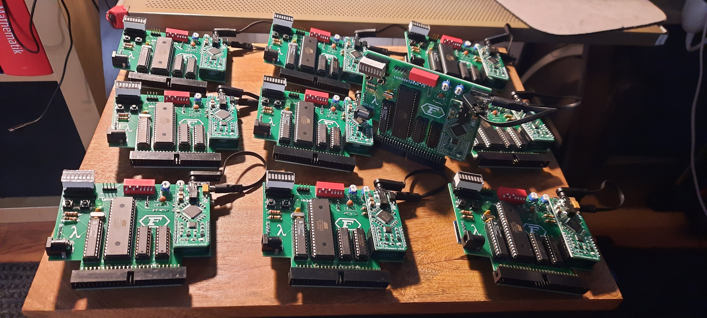

# LambdaSpeak FS

## Latest News 

The first batch of 10 was produced and distributed by TFM! 

 

 

 

 

## Demos 

[YouTube Video 1](https://youtu.be/KedbNqoHSpE)

[YouTube Video 2](https://youtu.be/ffm2ckMMNg4)

[YouTube Video 3](https://youtu.be/5-QFHwXAVIw)

## About

"LambdaSpeak FutureSoft" aka "LambdaSpeak FS" aka "LS-FS" aka "LSFS". 

Check out [LambdaSpeak
3](https://github.com/lambdamikel/LambdaSpeak3) for
details. LambdaSpeak FS does not have the SP0256-AL2, and the
EEPROM-based (autonomous PCM sample-playing) functions are not
available either. 

But it got a serial high speed connecter for additional usage.
Moreover, it features a new `echo-byte` mode, code `&C4` (yes, an
explosive feature it is!). This mode allows the CPC to take control
over the LED Bar Segment Display, which is actually 8 full 8bit
digital output port. It can be used as such by simply removing the
Segment Bar LED Display from the DIL socket and, e.g., by sticking
DuPont connector cables into it (instead of the LEDs). 

Another difference is optimized audio performance. Due to the absence
of the SP0256-AL2, we adopted a much simpler audio routing path,
omitting the audio op-amp for mixing, and optimized the filter
performance for a crystal clear and sharp sound. In comparison,
LambdaSpeak 3 sounds "warmer" and less clear / digital. Somewhat
similar to an Amiga 500 with filter on / off (LSFS is filter off).
For PCM sound, this give the optimal performance in our opinion. 

As with the LambdaSpeak 3, the Amdrum / PCM sample playing mode is
entered by sending control byte `&E3`. A new feature is that you can
exit / leave that mode by sending the "exit sequence".  The sequence
is `4 6 4 6 1 2 8`, plus 127, so `131, 133, 131, 133, 128, 129, 135`.
However, checking for exit might reduce PCM sample quality a bit, so
there is also a mode in which the exit check is not performed. See
below.

Compared to LambdaSpeak 3, LS FS offers more control over the Amdrum /
PCM sample quality. LS FS features three different Amdrum modes. The
default is the `Standard` Amdrum mode.  This mode does a lightshow on
the LED Segment Bar, and also performs the exit check. The PCM
clipping range is set to 5.

The Amdrum mode / PCM sample quality can be specified as follows, 
by first determining the mode, and then the mode is used 
when activated via `&E3`: 

- `&FE`: Use Standard Amdrum mode. This
has a default PCM clipping range of 5, the lightshow is 
enabled, and the "exit check" is performed. 
- `&FD` : Use Custom Amdrum mode. When `&E3` is activated, 4 parameters have to
be specified and sent to port `&FBEE` first, then the mode is
enabled with these custom settings. These 4 bytes: first lightshow off / on (0, 1), 
second perform exit check no / yes (0, 1),  third PCM sample byte clipping range (from 0 to 127),  
and fourth PCM smoothing delta (from 0 to 127). 
- `&FC` : Use High Quality Amdrum mode. Like the Standard mode, but without lightshow and 
the exit check is not performed, hence resulting in highest PCM sample quality possible, 
as the CPC databus is sampled with highest frequency. 

More details on [TFM's homepage.](http://futureos.cpc-live.com/) 

## Bill of Material

### Resistors 

- R7: 2k; ***note: must match D1 LED!*** 
- R1, R3, R4: 10k 
- R5: Jumper Wire 
- Rn: 9pin Resistor Array / Network, A102J

### Potentiometers / Trimmers: 

- RV1: 100 Ohm (Code 101) 
- RV2:  50k Ohm (Code 503) 

### Capacitors

- C1, C2: 22 pF (Code 220); ***note: these must match Q1!*** 
- C3: 68 nF (Code 683) 
- C5, C6, C7, C8: 100 nF (Code 104) 
- C9, C10: Jumper Wire 

### ICs 

- U1: GAL 22V10(B,D) 
- U2: 74LS374 
- U3: 74LS244 
- U4: ATmega 644-20PU
- Optional: DIL sockets for ICs (I recommend to use a socket at least for U4, to allow reprogramming) 

### Misc 

- CPC Connector: [2.54mm 2X25 50 Pin Right Angle Male Shrouded PCB Box Header IDC Connector](https://www.amazon.com/Madahu-Connectors-2-54mm-Shrouded-Connector/dp/B07XRH56QY) 
- Q1: [16 MHz Crystal](https://www.amazon.com/uxcell-Crystal-Oscillators-Resonators-Replacements/dp/B07Y7DVFCW/)
- SW3: [8 Position DIP Switch](https://www.amazon.com/Yohii-2-54mm-Positions-Double-Assorted/dp/B07DSBX4BK/) 
- D1: Activity LED 
- J8: [8 Segment LED Bar Display](https://www.amazon.com/Display-Segment-Graphics-Bar-Graph-8segmentos/dp/B07SMX1ZXX/)
- J2, J3: [2.54mm Pitch 8 Pin Single Row Straight Female Header Socket Connector for Arduino Shield (mikroBUS connector)](https://www.amazon.com/Comidox-2-54mm-Straight-Connector-Arduino/dp/B07J5B9LT5/)
- J7: Breakable Single Row Arduino Pin Headers 
- J4, J5: [Mini Stereo Audio Sockets](https://www.amazon.com/uxcell-Plastic-Stereo-Socket-Connector/dp/B00GLQAF7A/) 
- J1: [Optional Barrel Jack Power Connector](https://www.amazon.com/110PCS-2-1mm-Barrel-Type-Sockets-DC-005/dp/B073LF3FQK/)

### Modules 

- J2, J3: [TextToSpeech board](https://www.mikroe.com/text-to-speech-click) 
- MP3 / UART: [MP3 UART Module](https://www.amazon.com/Aideepen-YX5300-Control-Serial-Arduino/dp/B01JCI23JG) 
- RTC / I2C: [RTC IIC Module](https://www.amazon.com/Diymore-AT24C32-Arduino-Without-Battery/dp/B01IXXACD0)
- CR2032 3V Battery for RTC Module
- Mini SDCard for MP3 Module
- [Mini Stereo Audio Patch Cable](https://www.amazon.com/Tripp-Lite-P312-001-2RA-3-5mm-Stereo/dp/B00M5FKEUE/)

## Assembly Tipps 

- Don't forget the decoupling capacitors (104's) under the ICs! 
- If you are going to socket the ICs, then you will need to cut out the middle
struts from the DIL sockets to accomodate them.
- Use a fine side cutter to cut off the `SQW` and `32K` pins from the RTC module 